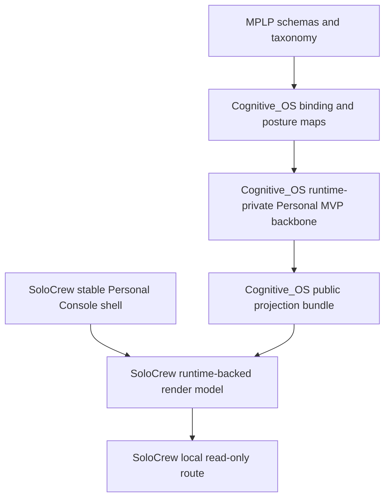
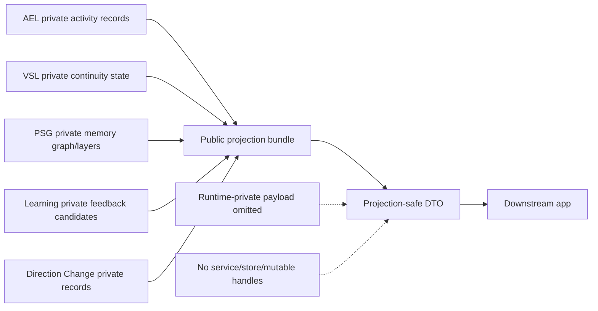
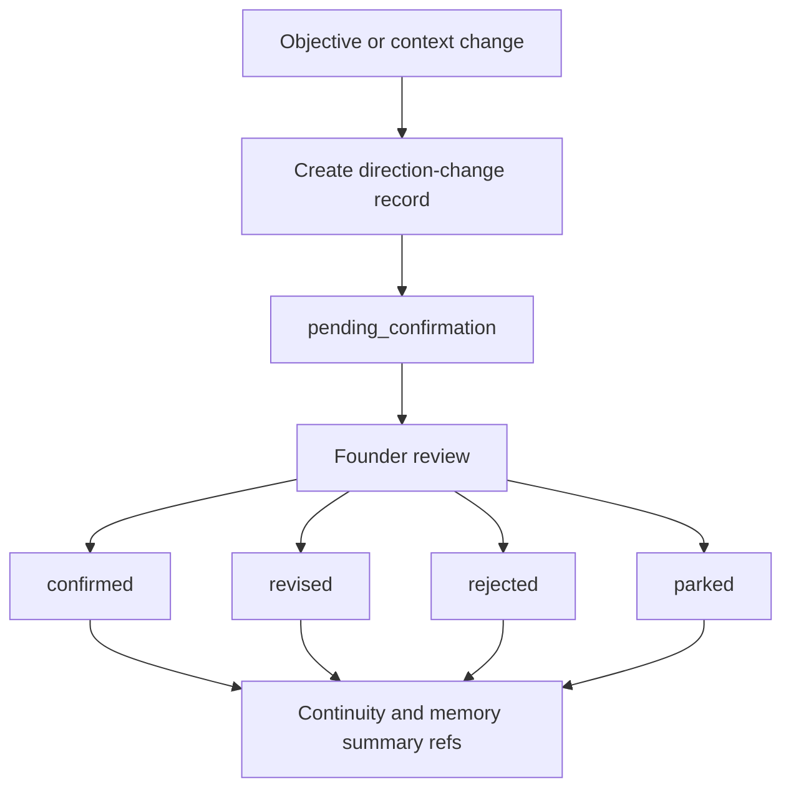
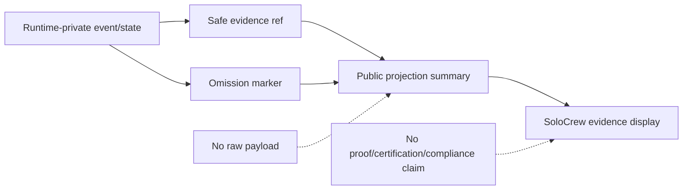

# CGOS Runtime Architecture Implementation Explainer 01

## Executive Summary

This report explains the current Cognitive_OS runtime implementation from code,
tests, package exports, and governance records. It does not describe a future
architecture as if it already exists.

Current overall verdict:

`MPLP_ALIGNED_RUNTIME_PROTOTYPE_WITH_PARTIAL_BINDINGS`

Cognitive_OS currently has:

- real runtime-private services for a minimal loop, Confirm, Trace, AEL
  activation assessment, PSG graph state, VSL continuity state, Delta
  Drift/Intent Drift impact assessment, governed learning candidates, boundary
  contracts, state stores, and projection-safe envelopes;
- a Personal MVP runtime-private vertical slice in
  `runtime/core/personal-mvp-runtime-backbone.ts` for AEL activity recording,
  VSL continuity summary state, PSG memory summary layers, Learning feedback,
  and Direction Change confirmation records;
- public DTOs and public bundles in `runtime/public/*`, especially
  `personal-mvp-runtime-backbone-dto.ts` and
  `personal-mvp-runtime-backbone-bundle.ts`, that expose downstream-safe
  summaries without exporting private service handles or raw state;
- explicit posture maps for all 10 MPLP modules and all 11 Kernel Duties;
- tests proving the bounded runtime behavior, public projection boundaries, and
  non-execution flags.

Cognitive_OS does not currently have:

- full MPLP 68-schema runtime reference coverage;
- full enterprise AEL, VSL, PSG, or Learning runtime;
- durable production persistence for the Personal MVP backbone;
- provider/model/tool/worker execution;
- publishing, payment, outreach, external action;
- automatic mutation, autonomous acceptance, training, or writeback;
- a full Delta Intent or Intent Drift engine.

SoloCrew now consumes the Cognitive_OS Personal MVP public projection bundle for
its Personal Console runtime-backed read-only render and local route. It does so
through public package imports, not through `runtime/core` or the legacy
`runtime-imports/cognitive-runtime.ts` bridge.

## Repo Truth Snapshot

Commands run for each repo:

```bash
git status --short
git branch --show-current
git rev-parse HEAD
git rev-parse origin/main
git tag --sort=-creatordate | head -10
```

```yaml
repo_truth:
  cognitive_os:
    url: https://github.com/Coregentis/Cognitive_OS.git
    branch: main
    local_head: de941fe43627e5eeb30ef1532b3861e73f86c942
    origin_head: de941fe43627e5eeb30ef1532b3861e73f86c942
    expected_baseline_match: true
    status:
      - "untracked .DS_Store"
      - "untracked governance/.DS_Store"
      - "untracked runtime/.DS_Store"
      - "untracked tests/.DS_Store"
    latest_tags:
      - cgos-projection-revision-runtime-rc-20260421
  mplp_protocol:
    url: https://github.com/Coregentis/MPLP-Protocol.git
    branch: main
    local_head: 214939ab6ba522036d376868d1fe8d04d960420f
    origin_head: 214939ab6ba522036d376868d1fe8d04d960420f
    expected_baseline_match: true
    status:
      - "untracked .DS_Store"
      - "untracked .github/.DS_Store"
      - "untracked examples/.DS_Store"
      - "untracked governance/.DS_Store"
      - "untracked packages/.DS_Store"
      - "untracked scripts/.DS_Store"
      - "untracked tests/.DS_Store"
    latest_tags:
      - protocol-v1.0.0
      - v1.0.0
  solocrew:
    url: https://github.com/Coregentis/SoloCrew.git
    branch: main
    local_head: 1f7c888e5d54707b33acd60df8ca1e71df4d17ad
    origin_head: 1f7c888e5d54707b33acd60df8ca1e71df4d17ad
    expected_baseline_match: true
    status: clean
    latest_tags:
      - solocrew-opc-true-mvp-candidate-v0.1
      - solocrew-opc-internal-mvp-candidate-v0.1
      - solocrew-runtime-production-baseline-v1.0-20260512
      - solocrew-v3.0-stable-deliverable-engagement-loop-20260430
      - solocrew-v3.0-rc-deliverable-engagement-loop-20260430
      - solocrew-v2.5-stable-semantic-stabilization-20260429
      - solocrew-v2.5-rc-semantic-stabilization-20260429
      - solocrew-v2.4-stable-commercialization-readiness-loop-20260428
      - solocrew-v2.4-rc-commercialization-readiness-loop-20260428
      - solocrew-v2.3-stable-first-paid-pilot-loop-20260428
```

Discovery commands used in Cognitive_OS:

```bash
find runtime -type f | sort
find tests/runtime -type f | sort
find governance -type f | sort
find projection -type f | sort || true
find schemas -type f | sort || true
cat package.json
grep -R "PSG\|VSL\|AEL\|Learning\|Delta Intent\|Intent Drift\|drift\|direction-change\|direction_change\|Confirm\|Trace\|Context\|Plan\|Role\|Collab\|Dialog\|Network\|Kernel\|kernel duty\|Evidence\|projection-safe\|runtime-private" -n runtime tests governance package.json | head -800
```

Important repo truth details:

- Cognitive_OS has no `projection/` directory.
- Cognitive_OS package exports are restricted to `runtime/public/*` surfaces.
- `./runtime/core/personal-mvp-runtime-backbone` is not package-exported.
- MPLP-Protocol currently has 68 schema/manifest/example/taxonomy/invariant
  files under `schemas/v2`.

## Current Implementation Verdicts

| Area | Verdict | File-backed reason |
| --- | --- | --- |
| Overall Cognitive_OS runtime | `MPLP_ALIGNED_RUNTIME_PROTOTYPE_WITH_PARTIAL_BINDINGS` | `runtime/core/*` includes real first-pass services and posture maps; `runtime/public/*` exposes projection-safe contracts; `governance/audits/CGOS-AS-MPLP-VENDOR-FREE-RUNTIME-FULL-SCHEMA-CONFORMANCE-AUDIT-01.md` records no full 68-schema runtime claim. |
| PSG | `PSG_PRIVATE_RUNTIME_WITH_PUBLIC_SUMMARY_PROJECTION` | `runtime/core/psg-service.ts` implements runtime-private graph nodes/edges; `runtime/core/personal-mvp-runtime-backbone.ts` implements Personal MVP three-layer memory summaries; public DTO/bundle exposes summaries only. |
| AEL | `AEL_ACTIVITY_RECORDING_ONLY_NO_EXECUTION` | `runtime/core/ael-service.ts` assesses activation and explicitly avoids provider execution; Personal MVP backbone records activity events with `no_provider_execution: true` and `no_tool_execution: true`. |
| VSL | `VSL_IN_MEMORY_CONTINUITY_ONLY` | `runtime/core/vsl-service.ts` uses `durability_mode: "runtime_instance_bounded_in_memory"`; Personal MVP backbone stores continuity in memory maps. |
| Learning | `LEARNING_FEEDBACK_RUNTIME_IMPLEMENTED_NO_TRAINING` | `runtime/core/consolidation-service.ts` creates suggestion-only learning candidates; Personal MVP feedback has states `suggested`, `confirmed`, `rejected`, `archived`, with `training_applied: false`. |
| Delta Intent / Intent Drift / Direction Change | `DIRECTION_CHANGE_CONFIRMATION_RUNTIME_IMPLEMENTED` | `runtime/core/reconcile-service.ts` assesses delta drift and creates runtime-private drift records, but the founder-facing complete lifecycle currently implemented for Personal MVP is Direction Change confirmation in the backbone and public projection. |

The Personal MVP runtime availability flags being true does not mean full
enterprise runtime is implemented. The public bundle distinguishes these states:

- Personal MVP AEL/VSL/PSG/Learning/Direction Change availability: true.
- Full enterprise AEL/VSL/PSG/Learning claims: false.
- Execution, mutation, autonomous acceptance, training, and writeback
  authority: false.

## Runtime Layer Map

| Layer | Purpose | Implemented Files | Public DTOs | Public Bundles | Private Runtime Services | Tests | Current Status | Notes |
| --- | --- | --- | --- | --- | --- | --- | --- | --- |
| AEL | Assess governed activation and record Personal MVP lifecycle activity. | `runtime/core/ael-service.ts`, `runtime/core/personal-mvp-runtime-backbone.ts` | `runtime/public/personal-mvp-runtime-backbone-dto.ts`, `runtime/public/operator-work-packet-handoff-dto.ts` | `runtime/public/personal-mvp-runtime-backbone-bundle.ts` | `DeterministicAelService`, `DeterministicPersonalMvpRuntimeBackbone` | `tests/runtime/ael-first-pass.test.mjs`, `tests/runtime/personal-mvp-runtime-backbone.test.mjs` | real bounded runtime-private behavior; no execution | AEL is activity/assessment, not provider/model/tool execution. |
| VSL | Store/recover continuity state and resume anchors. | `runtime/core/vsl-service.ts`, `runtime/core/personal-mvp-runtime-backbone.ts`, `runtime/in-memory/vsl-store.ts` | `runtime/public/personal-mvp-runtime-backbone-dto.ts`, `runtime/public/memory-continuity-review-dto.ts`, `runtime/public/runtime-objective-continuity-dto.ts` | `runtime/public/personal-mvp-runtime-backbone-bundle.ts` | `DeterministicVslService`, `InMemoryVslStore`, Personal MVP continuity map | `tests/runtime/vsl-first-pass.test.mjs`, `tests/runtime/personal-mvp-runtime-backbone.test.mjs` | in-memory continuity only | No production persistence claim for Personal MVP backbone. |
| PSG | Maintain runtime-private project graph and Personal MVP memory summaries. | `runtime/core/psg-service.ts`, `runtime/core/personal-mvp-runtime-backbone.ts`, `runtime/in-memory/psg-store.ts` | `runtime/public/personal-mvp-runtime-backbone-dto.ts`, `runtime/public/memory-continuity-review-dto.ts` | `runtime/public/personal-mvp-runtime-backbone-bundle.ts` | `DeterministicPsgService`, `InMemoryPsgStore`, Personal MVP memory map | `tests/runtime/psg-first-pass.test.mjs`, `tests/runtime/personal-mvp-runtime-backbone.test.mjs` | private graph plus public summary projection | Public output is node/ref/relation summaries, not raw graph state. |
| Learning | Capture governed learning candidates and Personal MVP feedback states. | `runtime/core/consolidation-service.ts`, `runtime/learning/*`, `runtime/core/personal-mvp-runtime-backbone.ts` | `runtime/public/personal-mvp-runtime-backbone-dto.ts`, `runtime/public/learning-correction-evidence-dto.ts`, `runtime/public/memory-preference-summary-dto.ts` | `runtime/public/personal-mvp-runtime-backbone-bundle.ts` | `DeterministicConsolidationService`, correction/preference services, Personal MVP learning map | `tests/runtime/governed-learning-first-pass.test.mjs`, `tests/runtime/personal-mvp-runtime-backbone.test.mjs` | feedback runtime without training | Learning candidates are reviewable; no automatic policy mutation or model training. |
| Direction Change | Create human-confirmable direction-change records for Personal MVP. | `runtime/core/personal-mvp-runtime-backbone.ts`, related first-pass drift code in `runtime/core/reconcile-service.ts` | `runtime/public/personal-mvp-runtime-backbone-dto.ts`, `runtime/public/memory-continuity-review-dto.ts` | `runtime/public/personal-mvp-runtime-backbone-bundle.ts` | `create_direction_change`, `update_direction_change_state`, `DeterministicReconcileService` | `tests/runtime/personal-mvp-runtime-backbone.test.mjs`, `tests/runtime/delta-drift-impact-first-pass.test.mjs` | Direction Change lifecycle implemented; full drift engine not implemented | Founder-facing label should remain Direction Change / Needs Confirmation. |
| Evidence / Trace | Create trace evidence and expose safe evidence refs. | `runtime/core/trace-service.ts`, `runtime/core/projection-service.ts`, `runtime/core/projection-safe-envelope.ts` | evidence refs in all relevant public DTOs | bundles validate/summarize safe projections | `DeterministicTraceService`, projection services | `tests/runtime/projection-safe-envelope.test.mjs`, `tests/runtime/projection-safe-contract.test.mjs` | partial public evidence posture | Evidence is summary/ref only, not proof/certification/compliance. |
| Projection-safe public surface | Downstream-safe contracts and helper bundles. | `runtime/public/*` | all `runtime/public/*-dto.ts` files | `operator-review-loop-handoff-bundle.ts`, `operator-work-packet-handoff-bundle.ts`, `personal-mvp-runtime-backbone-bundle.ts` | public bundles may internally use private deterministic services where allowed | public DTO/bundle boundary tests | implemented projection contracts | Public exports do not expose private service handles. |
| Runtime-private core | Runtime object creation, orchestration, stores, graph/continuity/learning internals. | `runtime/core/*`, `runtime/in-memory/*`, `runtime/state/*`, `runtime/execution/*`, `runtime/learning/*` | not directly exported as public DTOs | not public package exports | runtime core classes and stores | `tests/runtime/*.test.mjs` | real private prototype services | Downstream apps must not import runtime-private modules. |
| Kernel duty posture | Represent all 11 duties and their runtime/projection posture. | `runtime/core/default-kernel-duty-posture.ts`, `runtime/core/kernel-duty-runtime-posture.ts` | `runtime/public/operator-work-packet-handoff-dto.ts` carries `KernelDutyPosture` | operator work-packet bundle validates posture | posture records, not full duty engines | `tests/runtime/module-duty-posture.test.mjs` | all represented, not all implemented | Represented/projected/evidenced/enforced/implemented are distinct. |
| MPLP binding evidence | Bind Cognitive_OS surfaces to frozen MPLP truth without changing schemas. | `bindings/*`, `imports/*`, `runtime/core/frozen-truth-loader.ts`, `runtime/core/binding-service.ts` | version refs and binding refs in public DTOs | public bundles preserve binding refs | frozen binding/registry services | `tests/runtime/mplp-binding-correction-boundary.test.mjs`, `tests/runtime/operator-work-packet-mplp-binding.test.mjs` | partial binding evidence | No full MPLP 68-schema runtime conformance claim. |
| SoloCrew consumption | Consume public projection bundle for read-only Personal Console render/route. | SoloCrew `app/render/*`, `app/routes/personal-console-readonly-route.ts` | imports public CGOS DTO types | imports public CGOS bundle dynamically | no runtime-private CGOS services | SoloCrew route/render tests | public consumption implemented | Product labels remain SoloCrew layer; no CGOS/MPLP concept claim for product companies. |

## MPLP 10 Module Implementation Map

MPLP module schema paths in MPLP-Protocol:

- `schemas/v2/mplp-context.schema.json`
- `schemas/v2/mplp-plan.schema.json`
- `schemas/v2/mplp-confirm.schema.json`
- `schemas/v2/mplp-trace.schema.json`
- `schemas/v2/mplp-role.schema.json`
- `schemas/v2/mplp-extension.schema.json`
- `schemas/v2/mplp-dialog.schema.json`
- `schemas/v2/mplp-collab.schema.json`
- `schemas/v2/mplp-core.schema.json`
- `schemas/v2/mplp-network.schema.json`

Cognitive_OS module posture source:
`runtime/core/default-mplp-module-posture.ts`. Test coverage:
`tests/runtime/module-duty-posture.test.mjs`.

| MPLP module | MPLP schema path | Cognitive_OS files | Implementation kind | Implemented behavior | Public projection | SoloCrew consumption | Current gap | Non-claims |
| --- | --- | --- | --- | --- | --- | --- | --- | --- |
| Context | `schemas/v2/mplp-context.schema.json` | `runtime/core/form-service.ts`, `memory-service.ts`, `projection-service.ts`, `default-mplp-module-posture.ts`, Personal MVP DTO/bundle | `runtime_private_service`, `public_dto`, `public_bundle`, `test`, `governance_doc` | Captures neutral intake/context substrate and projects summaries/refs. Module posture is `partial_runtime_realization`. | Operator intent/work intake, memory continuity summaries, Personal MVP PSG/VSL summaries. | Personal Console maps Secretary intake and memory summaries to public projection input. | No full public Context object implementation over the MPLP schema. | No raw prompt/workspace memory exposure. |
| Plan | `schemas/v2/mplp-plan.schema.json` | `runtime/core/runtime-orchestrator.ts`, `policy-service.ts`, `default-mplp-module-posture.ts` | `runtime_private_service`, `public_dto`, `test`, `governance_doc` | Minimal loop and work packet/next-action posture exist. Module posture is `partial_runtime_realization`. | Work packet summary, assignment summary, VSL next-safe-action summary. | Personal Console maps work packets, next actions, packet/artifact states. | No full Plan schema object emitted as public runtime contract. | No execution readiness or automatic dispatch claim. |
| Confirm | `schemas/v2/mplp-confirm.schema.json` | `runtime/core/confirm-service.ts`, `operator-review-loop-workflow.ts`, Personal MVP backbone | `runtime_private_service`, `public_dto`, `public_bundle`, `test` | Confirm gates and review/decision summaries exist; Direction Change creates pending confirmation records. Module posture is `explicit_runtime_realization`. | Acceptance/review summaries, direction change summary requiring operator confirmation. | Needs Your Decision and Direction Change Confirmation sections consume this posture. | Personal MVP has bounded confirmation; not full enterprise review workflow. | Human final authority remains required. |
| Trace | `schemas/v2/mplp-trace.schema.json` | `runtime/core/trace-service.ts`, `projection-safe-envelope.ts`, `projection-service.ts` | `runtime_private_service`, `public_dto`, `test` | Trace evidence and decision records are created privately and exposed as safe refs. Module posture is `explicit_runtime_realization`. | Safe evidence refs, omission markers, evidence posture summaries. | Evidence export candidate displays refs only. | No full trace stream/event bus public runtime. | Evidence is not proof, certification, compliance, or endorsement. |
| Role | `schemas/v2/mplp-role.schema.json` | `runtime/core/registry-service.ts`, worker lifecycle surfaces, `default-mplp-module-posture.ts` | `runtime_private_service`, `public_dto`, `test` | Role/worker responsibility posture exists as summaries. Module posture is `partial_runtime_realization`. | Assignment and worker lifecycle summary DTOs. | Human responsibility review queue and company workspace labels remain product-layer. | No full Role schema implementation. | No real worker execution authority. |
| Extension | `schemas/v2/mplp-extension.schema.json` | `runtime/core/default-mplp-module-posture.ts`, `execution-boundary-contract.ts`, `prepared-action-contract.ts` | `public_dto`, `test`, `governance_doc`, `marker_only` | Extension is explicitly unavailable/safe deferred. Module posture is `unavailable_safe_deferred`. | No-dispatch/no-tool/no-provider boundary flags; action request summaries only. | Personal Console shows blocked execution/publishing/external action. | No governed extension runtime implemented. | No marketplace/provider/channel routing. |
| Dialog | `schemas/v2/mplp-dialog.schema.json` | `runtime/core/form-service.ts`, `default-mplp-module-posture.ts`, operator work-packet DTO | `public_dto`, `test`, `marker_only` | Dialog is represented through refs/clarification posture only. Module posture is `implicit_only`. | `dialog_ref`, `clarification_ref`, omission markers, no full dialog runtime flags. | Secretary Conversation Console uses SoloCrew product text; CGOS supplies intake/memory/direction summary posture, not conversation runtime. | No full Dialog runtime or transcript continuity. | No raw conversation transcript public exposure. |
| Collab | `schemas/v2/mplp-collab.schema.json` | `runtime/core/runtime-orchestrator.ts`, `registry-service.ts`, worker lifecycle surfaces, `default-mplp-module-posture.ts` | `runtime_private_service`, `public_dto`, `test` | Collaboration/coordination posture exists through assignments, review, lifecycle. Module posture is `partial_runtime_realization`. | Assignment, worker activity, review and duty summaries. | Development Company / Media Operation Company remain SoloCrew product grouping labels. | No full Collab schema object or multi-party collaboration engine. | Product companies are not CGOS/MPLP concepts. |
| Core | `schemas/v2/mplp-core.schema.json` | `runtime/core/frozen-truth-loader.ts`, `binding-service.ts`, `registry-service.ts`, `default-mplp-module-posture.ts` | `runtime_private_service`, `public_dto`, `test`, `governance_doc` | Protocol/binding/runtime refs and frozen truth boundaries exist. Module posture is `partial_runtime_realization`. | Version refs, compatibility profiles, boundary flags. | SoloCrew records CGOS baseline refs and public bundle import names. | No certification/full conformance assertion. | No MPLP schema/protocol/normative binding change. |
| Network | `schemas/v2/mplp-network.schema.json` | `runtime/core/default-mplp-module-posture.ts`, boundary contracts | `public_dto`, `test`, `marker_only` | Network is explicitly unavailable/safe deferred. Module posture is `unavailable_safe_deferred`. | No-channel/no-network/external action denial flags. | Personal Console blocks outreach, publishing, payment, external action. | No network routing/channel runtime. | No customer outreach or external dispatch. |

Strict interpretation:

- `runtime_private_service` means behavior exists in `runtime/core` or related
  private runtime paths.
- `public_dto` means a downstream-safe type/projection surface exists.
- `public_bundle` means a downstream-safe function bundle exists.
- `marker_only` means refs/markers/omissions are present but no real module
  runtime exists.
- `missing` is used when neither behavior nor meaningful projection exists.

## 11 Kernel Duty Implementation Map

MPLP taxonomy source: `MPLP-Protocol/schemas/v2/taxonomy/kernel-duties.yaml`.

Cognitive_OS files inspected:

- `runtime/core/default-kernel-duty-posture.ts`
- `runtime/core/kernel-duty-runtime-posture.ts`
- `runtime/public/operator-work-packet-handoff-dto.ts`
- `tests/runtime/module-duty-posture.test.mjs`
- `bindings/mplp-kernel-duty-coregentis-binding.v0.yaml`

Vocabulary used in this section:

- `represented`: the duty id/name/posture row exists.
- `projected`: a public DTO exposes a safe summary or posture.
- `evidenced`: tests or evidence refs demonstrate bounded behavior.
- `enforced`: runtime/test gates reject invalid or forbidden states.
- `implemented`: runtime logic owns behavior beyond posture.

These terms are not interchangeable.

| Kernel Duty | MPLP Taxonomy Source | Cognitive_OS Posture Exists? | Runtime Implementation Status | Public Projection Status | Tests | Full Implementation? | Personal MVP Relevant? | Gap |
| --- | --- | --- | --- | --- | --- | --- | --- | --- |
| KD-01 Coordination | `schemas/v2/taxonomy/kernel-duties.yaml` | yes, represented in `default-kernel-duty-posture.ts` | `PARTIAL_RUNTIME_REALIZATION` | projected in work-packet and Personal MVP section mapping | `module-duty-posture.test.mjs`, minimal loop tests | no | yes | Coordination exists as bounded orchestration/posture, not full workflow authority. |
| KD-02 Error Handling | same | yes | `PARTIAL_RUNTIME_REALIZATION` | projected through insufficiency/omission/validation summaries | boundary and failure-path tests | no | yes | Error posture exists; full recovery system is not implemented. |
| KD-03 Event Bus | same | yes | `IMPLICIT_ONLY` | event refs/timeline summaries only | minimal loop/trace/AEL tests | no | partial | No public event bus or routing mechanics. |
| KD-04 Learning Feedback | same | yes | `PARTIAL_RUNTIME_REALIZATION` | projected in learning correction DTOs and Personal MVP feedback summary | governed learning and Personal MVP tests | no | yes | Learning feedback exists; no training engine. |
| KD-05 Observability | same | yes | `PARTIAL_RUNTIME_REALIZATION` | projected as safe evidence refs, omission markers, projection envelopes | projection/evidence tests | no | yes | Evidence refs exist; no proof/certification/compliance claim. |
| KD-06 Orchestration | same | yes | `EXPLICIT_RUNTIME_REALIZATION` | projected as step/work-packet summaries, not handles | `minimal-loop.test.mjs` | partial only | yes | Minimal runtime skeleton exists, not product orchestration or execution. |
| KD-07 Performance | same | yes | `IMPLICIT_ONLY` | no formal public performance contract | deterministic store tests only | no | no | No performance service or SLA posture. |
| KD-08 Protocol Versioning | same | yes | `PARTIAL_RUNTIME_REALIZATION` | projected as version refs and binding refs | binding correction tests | no | yes | Version refs exist; not a conformance/certification system. |
| KD-09 Security | same | yes | `PARTIAL_RUNTIME_REALIZATION` | projected and enforced through no-private/no-authority boundary flags | strict boundary tests, public bundle tests | no | yes | Strong projection boundaries exist, but not full security framework. |
| KD-10 State Sync | same | yes | `PARTIAL_RUNTIME_REALIZATION` | projected through VSL/continuity summaries and state refs | VSL/state tests | no | yes | In-memory continuity, not production state synchronization. |
| KD-11 Transaction | same | yes | `IMPLICIT_ONLY` | snapshot/export posture only | transaction/export posture tests | no | future | No formal transaction engine or distributed transaction semantics. |

Kernel Duty summary:

- All 11 duties are represented.
- Several are projected and evidenced.
- Some boundaries are enforced by tests and validators.
- Only orchestration has an explicit first-pass runtime skeleton.
- None of the above equals full implementation of all 11 duties.

## PSG Implementation Detail

Where PSG is implemented:

- `runtime/core/psg-service.ts`
- `runtime/in-memory/psg-store.ts`
- `runtime/core/runtime-types.ts`
- `runtime/core/personal-mvp-runtime-backbone.ts`
- `runtime/public/personal-mvp-runtime-backbone-dto.ts`
- `runtime/public/personal-mvp-runtime-backbone-bundle.ts`
- `tests/runtime/psg-first-pass.test.mjs`
- `tests/runtime/personal-mvp-runtime-backbone.test.mjs`
- `tests/runtime/personal-mvp-runtime-backbone-public-bundle.test.mjs`

Private PSG graph runtime:

`DeterministicPsgService` in `runtime/core/psg-service.ts` maintains a
project-scoped runtime-private graph. It creates:

- `RuntimePsgNodeRecord`
- `RuntimePsgRelationEdge`
- `RuntimePsgGraphState`
- `RuntimePsgGraphUpdateSummary`

The graph state uses `export_class: "runtime_private_non_exportable"`. The
service derives relationships from lineage, anchors, reference fields, and
evidence support. Relation types in `runtime/core/runtime-types.ts` include:

- `references`
- `contains`
- `derived_from`
- `promoted_from`
- `conflicts_with`
- `governs`
- `evidences`

Personal MVP PSG runtime:

`runtime/core/personal-mvp-runtime-backbone.ts` implements a deterministic
in-memory memory-summary graph for Personal MVP use. It stores memory layers in
a map and exposes three public summary layers:

- `operator_intake_psg`
- `project_scope_psg`
- `task_scope_psg`

The public DTO shape is:

- `PersonalMvpPsgMemorySummary`
- `PersonalMvpPsgMemoryLayerSummary`

Each public layer summary contains:

- `layer`
- `summary`
- `node_refs`
- `relation_refs`
- `safe_evidence_refs`
- `runtime_private_payload_omitted: true`

Is there a full graph runtime?

No. There is a real private first-pass graph service and a real Personal MVP
summary runtime, but not a full enterprise PSG graph runtime with durable graph
storage, graph query language, graph event conformance over all MPLP event
schemas, or public graph payload export.

Is it durable?

No durable PSG persistence is proven for the Personal MVP runtime backbone.
`runtime/in-memory/psg-store.ts` is in-memory. The Personal MVP backbone uses
private in-memory maps.

How is it projected publicly?

The public projection path is:

```text
runtime/core/personal-mvp-runtime-backbone.ts
-> runtime/public/personal-mvp-runtime-backbone-dto.ts
-> runtime/public/personal-mvp-runtime-backbone-bundle.ts
-> cognitive_os/runtime/public/personal-mvp-runtime-backbone-bundle
```

The package export exists for the DTO and bundle, not for the private core
service. `tests/runtime/personal-mvp-runtime-backbone-public-bundle.test.mjs`
checks that the public bundle is package-exported and the runtime-private
backbone is not package-exported.

How does SoloCrew consume it?

SoloCrew `app/render/create-personal-console-runtime-backed-render-model.ts`
maps product shell sections into plain `memory_layers` input for the CGOS public
bundle. It passes `operator_intake_psg`, `project_scope_psg`, and
`task_scope_psg`. It does not import `runtime/core/psg-service.ts`.

What is not implemented?

- Full enterprise PSG runtime.
- Durable PSG persistence for the Personal MVP backbone.
- Public raw graph state export.
- PSG as an MPLP-native object schema.
- Product company semantics in CGOS; Development Company and Media Operation
  Company remain SoloCrew product-layer labels.

## AEL Implementation Detail

Where AEL is implemented:

- `runtime/core/ael-service.ts`
- `runtime/core/personal-mvp-runtime-backbone.ts`
- `runtime/core/runtime-types.ts`
- `runtime/public/personal-mvp-runtime-backbone-dto.ts`
- `runtime/public/personal-mvp-runtime-backbone-bundle.ts`
- `tests/runtime/ael-first-pass.test.mjs`
- `tests/runtime/personal-mvp-runtime-backbone.test.mjs`

Private AEL first pass:

`DeterministicAelService` in `runtime/core/ael-service.ts` implements governed
activation assessment. It returns `RuntimeAelAssessment` with:

- `outcome`: `activate`, `confirm_required`, `suppressed`, or `escalate`
- `gating_basis`: `policy_allow`, `confirm_gate`, `policy_suppression`, or
  `reconcile_tension`
- matched rule ids
- confirm gate id when applicable
- evidence refs
- `export_class: "runtime_private_non_exportable"`

The service explicitly notes that this is a runtime-private governed activation
assessment and does not define provider execution or product workflow law.

Personal MVP AEL:

`DeterministicPersonalMvpRuntimeBackbone` records activity events through
`record_activity`. Runtime records include:

- `activity_ref`
- `recorded_at`
- `activity_kind`
- `summary`
- `source_ref`
- `safe_evidence_refs`
- `export_class: "runtime_private_non_exportable"`
- `no_provider_execution: true`
- `no_tool_execution: true`

The public DTO exposes `PersonalMvpAelActivitySummary` with:

- activity count
- latest activity ref
- activity kinds
- activity refs
- safe evidence refs
- runtime private payload omitted

Does AEL execute actions?

No. The Personal MVP AEL is activity recording only. The older AEL first-pass
service assesses activation/gating; it does not call providers, models, tools,
workers, channels, or external APIs.

What activity kinds exist?

From `runtime/public/personal-mvp-runtime-backbone-dto.ts`:

- `operator_goal_captured`
- `memory_read`
- `direction_change_detected`
- `confirmation_requested`
- `task_decomposed`
- `output_recorded`
- `human_review_recorded`
- `evidence_recorded`

How does SoloCrew consume it?

SoloCrew maps activity timeline events in
`app/render/create-personal-console-runtime-backed-render-model.ts` to CGOS
activity input. The resulting public projection drives the Activity Timeline and
status panels in the read-only page.

What remains missing?

- Provider/model/tool/worker execution.
- Full enterprise AEL runtime.
- Durable event log/event bus.
- Public raw activation records.

## VSL Implementation Detail

Where VSL is implemented:

- `runtime/core/vsl-service.ts`
- `runtime/in-memory/vsl-store.ts`
- `runtime/core/runtime-types.ts`
- `runtime/core/personal-mvp-runtime-backbone.ts`
- `runtime/public/personal-mvp-runtime-backbone-dto.ts`
- `runtime/public/memory-continuity-review-dto.ts`
- `tests/runtime/vsl-first-pass.test.mjs`
- `tests/runtime/personal-mvp-runtime-backbone.test.mjs`

Private VSL first pass:

`DeterministicVslService` in `runtime/core/vsl-service.ts` writes
`RuntimeVslContinuityState` through `checkpoint_project_continuity`. The state
includes:

- project and scenario ids
- continuity revision
- `durability_mode: "runtime_instance_bounded_in_memory"`
- continuity status: `recoverable` or `review_required`
- last completed step
- continuation anchor
- replay horizon
- rollback horizon
- retention horizon
- store snapshot

The first-pass VSL can load continuity state and recover a continuation anchor.
Replay/rollback/retention are metadata horizons, not full replay/rollback
execution engines.

Personal MVP VSL:

`runtime/core/personal-mvp-runtime-backbone.ts` stores
`PersonalMvpVslContinuityState` in memory and exposes
`PersonalMvpVslContinuitySummary` publicly. The required fields include:

- `current_mission_state`
- `progress_state`
- `review_state`
- `packet_state`
- `artifact_state`
- `resume_pointer`
- `last_confirmed_direction`
- `next_safe_action`
- safe evidence refs

Is state durable?

No durable production persistence is implemented for this Personal MVP
backbone. The runtime is deterministic and in-memory. Some broader state store
files exist under `runtime/state/`, including SQLite-backed infrastructure, but
the Personal MVP backbone itself does not claim durable production VSL.

How is it projected publicly?

The public DTO exposes VSL as summary state only. `memory-continuity-review` is
a projection-safe public summary surface with full-runtime flags false; the
newer Personal MVP runtime backbone DTO/bundle exposes Personal MVP continuity
runtime availability true while still keeping full enterprise VSL false.

What remains missing?

- Durable Personal MVP VSL persistence.
- Full replay/rollback runtime.
- Distributed transaction/state sync semantics.
- Raw VSL public payload export.

## Learning Implementation Detail

Where Learning is implemented:

- `runtime/core/consolidation-service.ts`
- `runtime/learning/correction-capture.ts`
- `runtime/learning/preference-writeback.ts`
- `runtime/learning/objective-anchor.ts`
- `runtime/core/personal-mvp-runtime-backbone.ts`
- `runtime/public/personal-mvp-runtime-backbone-dto.ts`
- `runtime/public/learning-correction-evidence-dto.ts`
- `runtime/public/memory-preference-summary-dto.ts`
- `tests/runtime/governed-learning-first-pass.test.mjs`
- `tests/runtime/p0b-correction-capture.test.mjs`
- `tests/runtime/p0b-preference-writeback.test.mjs`
- `tests/runtime/personal-mvp-runtime-backbone.test.mjs`

Private governed learning:

`DeterministicConsolidationService` creates
`RuntimeGovernedLearningAssessment` and `learning-candidate` runtime objects.
The assessment is explicitly:

- `suggestion_only: true`
- `policy_mutation_applied: false`
- `semantic_promotion_applied: false`
- `export_class: "runtime_private_non_exportable"`

It may classify candidates as:

- `success_pattern`
- `failure_pattern`
- `reuse_pattern`
- `policy_suggestion`

Personal MVP learning feedback:

The Personal MVP backbone captures reviewable feedback candidates with:

- learning kinds: `style_preference`, `workflow_preference`,
  `output_quality_feedback`
- states: `suggested`, `confirmed`, `rejected`, `archived`
- `mutation_applied: false`
- `training_applied: false`

Is it a learning engine?

No. This is a governed feedback/candidate runtime and a Personal MVP feedback
state runtime. It does not train models, automatically change behavior, mutate
policy, promote semantic facts automatically, or write back without authority.

How is it projected publicly?

The Personal MVP projection exposes:

- feedback count
- states present
- candidate refs
- safe evidence refs
- runtime private payload omitted

SoloCrew maps Learning Drawer evidence summaries to the public bundle as plain
learning feedback input and renders founder-facing labels. Intent Drift is not
used as the primary product label for that surface.

What remains missing?

- Full learning engine.
- Automatic training.
- Automatic writeback.
- Durable preference/learning production workflow as part of the Personal MVP
  backbone.
- MPLP learning sample export as a finalized protocol process.

## Delta Intent / Intent Drift / Direction Change Implementation Detail

Direct classification:

```yaml
delta_intent:
  status: DELTA_INTENT_CANDIDATE_OR_RUNTIME_OBJECT_ONLY
  files:
    - runtime/core/runtime-types.ts
    - runtime/core/reconcile-service.ts
    - runtime/core/runtime-orchestrator.ts
    - bindings/coregentis-export-rules.v0.yaml
    - bindings/mplp-coregentis-binding-matrix.v0.yaml
    - tests/runtime/delta-drift-impact-first-pass.test.mjs
  explanation: >
    `delta-intent` exists as a Coregentis runtime object type and as an input to
    `assess_delta_drift_impact`. Binding/export rules mark it
    protocol-adjacent and export-restricted. There is not a full Delta Intent
    public engine or canonical MPLP object export.
intent_drift:
  status: INTENT_DRIFT_MARKER_OR_EVIDENCE_ONLY_WITH_PRIVATE_FIRST_PASS_ASSESSMENT
  files:
    - runtime/core/reconcile-service.ts
    - runtime/core/runtime-types.ts
    - tests/runtime/delta-drift-impact-first-pass.test.mjs
    - runtime/public/operator-work-packet-handoff-dto.ts
  explanation: >
    `DeterministicReconcileService` produces a
    `RuntimeDeltaDriftImpactAssessment` with `drift_kind: "intent_drift"` and
    can create runtime-private `drift-record` objects. Public work-packet
    surfaces carry markers/refs. A full Intent Drift engine is not implemented.
direction_change:
  status: DIRECTION_CHANGE_CONFIRMATION_RUNTIME_IMPLEMENTED
  files:
    - runtime/core/personal-mvp-runtime-backbone.ts
    - runtime/public/personal-mvp-runtime-backbone-dto.ts
    - runtime/public/personal-mvp-runtime-backbone-bundle.ts
    - tests/runtime/personal-mvp-runtime-backbone.test.mjs
    - tests/runtime/personal-mvp-runtime-backbone-public-bundle.test.mjs
  explanation: >
    The Personal MVP backbone creates direction-change records with
    `pending_confirmation`, requires operator confirmation, and denies automatic
    acceptance. This is the founder-facing lifecycle SoloCrew consumes.
```

Relationship:

- Delta Intent is the runtime change-object/candidate layer.
- Intent Drift is the private assessment/evidence marker layer used to detect
  tension between new intent and prior state.
- Direction Change is the Personal MVP human-facing confirmation lifecycle that
  SoloCrew should display.

Current verdict:

`DIRECTION_CHANGE_CONFIRMATION_RUNTIME_IMPLEMENTED`

Why not `DELTA_INTENT_AND_INTENT_DRIFT_FULLY_IMPLEMENTED`?

The code supports delta-intent object types and private drift impact assessment,
but does not expose a full public Delta Intent or Intent Drift engine, does not
implement durable drift workflows, and does not authorize automatic acceptance
or compensation execution. Founder-facing product language should remain
Direction Change / Needs Confirmation.

## Evidence and Trace Implementation Detail

Trace and evidence are implemented in:

- `runtime/core/trace-service.ts`
- `runtime/core/projection-service.ts`
- `runtime/core/projection-safe-envelope.ts`
- `runtime/public/runtime-objective-continuity-dto.ts`
- `runtime/public/personal-mvp-runtime-backbone-dto.ts`
- `runtime/public/memory-continuity-review-dto.ts`
- `runtime/public/operator-work-packet-handoff-dto.ts`
- `bindings/coregentis-export-rules.v0.yaml`

Private trace behavior:

`DeterministicTraceService` creates runtime objects:

- `trace-evidence`
- `decision-record`

Export rules classify `trace-evidence` and `confirm-gate` as narrow
`protocol_compliant_export` candidates. Many other objects, including
`drift-record`, `decision-record`, `work-item`, `episode`, and
`memory-promotion-record`, are `runtime_private_non_exportable`.

Public evidence refs:

Public DTOs expose evidence as:

- `evidence_ref`
- optional evidence kind
- source ref
- bounded summary
- privacy treatment
- omission markers
- `runtime_private_payload_omitted: true`

No raw payload exposure:

Projection services and public bundle tests reject raw/private keys such as raw
payloads, service instances, mutable handles, provider/model/tool handles, raw
graph state, and private stores.

Omissions:

Omissions are explicit public markers that explain what was withheld and why.
For Personal MVP projections, omissions include runtime-private fields and raw
runtime payloads. The safe alternative is a ref or summary, not a hidden payload.

Evidence aggregation:

The Personal MVP backbone aggregates evidence refs from AEL activity, VSL
continuity, PSG memory layers, Learning feedback, and Direction Change records
into `safe_evidence_refs`. The public bundle validates these summaries without
exposing private records.

Required non-claims:

- No certification claim.
- No proof claim.
- No compliance claim.
- No endorsement claim.
- No raw runtime-private payload exposure.

SoloCrew preserves these non-claims in its read-only Personal Console route and
tests `no_certification_claim`, `no_proof_claim`, and `no_compliance_claim`.

## Public Projection Surface Map

Current relevant public exports in `package.json` include:

- `./runtime/public/operator-review-loop-dto`
- `./runtime/public/operator-review-loop-handoff-bundle`
- `./runtime/public/runtime-readiness-status-dto`
- `./runtime/public/runtime-projection-summary-dto`
- `./runtime/public/runtime-execution-event-dto`
- `./runtime/public/runtime-objective-continuity-dto`
- `./runtime/public/state-port-summary-dto`
- `./runtime/public/persistence-roundtrip-evidence-dto`
- `./runtime/public/memory-preference-summary-dto`
- `./runtime/public/memory-continuity-review-dto`
- `./runtime/public/personal-mvp-runtime-backbone-dto`
- `./runtime/public/personal-mvp-runtime-backbone-bundle`
- `./runtime/public/learning-correction-evidence-dto`
- `./runtime/public/runtime-action-request-summary-dto`
- `./runtime/public/runtime-dispatch-boundary-evidence-dto`
- `./runtime/public/runtime-session-summary-dto`
- `./runtime/public/runtime-session-evidence-dto`
- `./runtime/public/worker-lifecycle-summary-dto`
- `./runtime/public/worker-lifecycle-evidence-dto`
- behavior snapshot DTOs
- `./runtime/public/operator-work-packet-handoff-dto`
- `./runtime/public/operator-work-packet-handoff-bundle`

Focused public surface map:

| Export path | File | Purpose | Runtime-backed? | Type-only? | Function bundle? | Downstream-safe? | Exposes private runtime? | Used by SoloCrew? | Tests |
| --- | --- | --- | --- | --- | --- | --- | --- | --- | --- |
| `./runtime/public/operator-work-packet-handoff-dto` | `runtime/public/operator-work-packet-handoff-dto.ts` | Operator work-packet projection-safe contract with 10 module names, kernel duty posture, advanced refs/markers. | no direct runtime execution; deterministic projection contract | yes | no | yes | no | older OPC/projection consumption paths | `operator-work-packet-handoff-dto.test.mjs`, boundary tests |
| `./runtime/public/operator-work-packet-handoff-bundle` | `runtime/public/operator-work-packet-handoff-bundle.ts` | Deterministic assembly/validation/summary helper for work-packet envelopes. | helper over safe input | no | yes | yes | no | SoloCrew OPC fixtures and route seed path | `operator-work-packet-handoff-boundary.test.mjs` |
| `./runtime/public/memory-continuity-review-dto` | `runtime/public/memory-continuity-review-dto.ts` | Projection-safe memory/continuity/direction-change review summary DTO. | no; summary/ref/omission only | yes | no | yes | no | SoloCrew seeds shell/route memory continuity summaries | `memory-continuity-review-public-contract.test.mjs` |
| `./runtime/public/personal-mvp-runtime-backbone-dto` | `runtime/public/personal-mvp-runtime-backbone-dto.ts` | Public DTO for Personal MVP runtime-backed projection. | yes, through public bundle output | yes | no | yes | no | SoloCrew runtime-backed render imports types | `personal-mvp-runtime-backbone.test.mjs`, package export tests |
| `./runtime/public/personal-mvp-runtime-backbone-bundle` | `runtime/public/personal-mvp-runtime-backbone-bundle.ts` | Public facade for creating, validating, and summarizing Personal MVP runtime-backed projection from plain data. | yes, internally uses private deterministic backbone | no | yes | yes | no | SoloCrew Personal Console runtime-backed render and route | `personal-mvp-runtime-backbone-public-bundle.test.mjs` |
| `./runtime/public/runtime-objective-continuity-dto` | `runtime/public/runtime-objective-continuity-dto.ts` | Shared public evidence refs, omission markers, version refs, objective continuity DTOs. | partial public projection | yes | no | yes | no | used indirectly by DTO type imports | public surface tests |
| `./runtime/public/learning-correction-evidence-dto` | `runtime/public/learning-correction-evidence-dto.ts` | Learning correction evidence summary. | public evidence/correction surface | yes | no | yes | no | older SoloCrew learning paths | learning correction tests |
| `./runtime/public/runtime-action-request-summary-dto` | same | Prepared/action request summary boundary. | projection-only | yes | no | yes | no | older action-prep paths | action boundary tests |
| `./runtime/public/runtime-dispatch-boundary-evidence-dto` | same | Dispatch boundary evidence. | projection-only | yes | no | yes | no | older boundary evidence paths | dispatch boundary tests |

The public Personal MVP bundle is the key handoff for current SoloCrew Personal
Console consumption. It is allowed to use the deterministic runtime-private
backbone internally, but downstream apps only receive DTO output.

## Runtime-Private Service Map

| File | Purpose | Exported by package? | Used internally by public bundle? | Safe for SoloCrew direct import? | Reason |
| --- | --- | --- | --- | --- | --- |
| `runtime/core/personal-mvp-runtime-backbone.ts` | Personal MVP runtime-private vertical slice for AEL/VSL/PSG/Learning/Direction Change. | no | yes, by `personal-mvp-runtime-backbone-bundle.ts` | no | Contains runtime classes, private in-memory maps, and private records. |
| `runtime/core/psg-service.ts` | Runtime-private project semantic graph service. | no | no direct public package bundle use for SoloCrew current route | no | Raw graph state is runtime-private and non-exportable. |
| `runtime/core/ael-service.ts` | Governed activation assessment service. | no | no | no | Assessment is private and not provider execution. |
| `runtime/core/vsl-service.ts` | Continuity checkpoint/load/recover service. | no | no | no | VSL state is private and in-memory in current implementation. |
| `runtime/core/reconcile-service.ts` | Delta drift impact assessment, drift records, conflict cases, reconciliation. | no | no | no | Drift records are private and not a full public drift engine. |
| `runtime/core/consolidation-service.ts` | Governed learning assessment, learning candidates, memory promotion records. | no | no | no | Learning candidates are private; public output is refs/summaries. |
| `runtime/core/trace-service.ts` | Trace evidence and decision record creation. | no | no direct public export | no | Runtime objects remain private; public evidence refs are safe. |
| `runtime/core/projection-service.ts` | Projection-safe summary construction and validation. | no | no direct public package export | no | Internal validation and projection helpers; not a downstream API. |
| `runtime/core/default-kernel-duty-posture.ts` | Default 11 Kernel Duty runtime posture map. | no | no | no | Posture evidence, not downstream runtime control. |
| `runtime/core/default-mplp-module-posture.ts` | Default 10 MPLP module posture map. | no | no | no | Posture evidence, not downstream runtime control. |
| `runtime/in-memory/psg-store.ts` | In-memory PSG store. | no | no | no | Store handle is private. |
| `runtime/in-memory/vsl-store.ts` | In-memory VSL store. | no | no | no | Store handle is private. |
| `runtime/state/sqlite-state-store.ts` | Broader state-store infrastructure. | no | no | no | Not part of Personal MVP public bundle; no direct app import. |
| `runtime/execution/*` | Execution boundary/envelope/event infrastructure. | no public direct package export | no | no | Boundaries/prepared action surfaces do not authorize external execution. |
| `runtime/learning/*` | Correction/preference/objective learning support. | no direct package export | no | no | Learning internals are not a public engine handle. |

Package export status:

- Exported: `./runtime/public/personal-mvp-runtime-backbone-dto`
- Exported: `./runtime/public/personal-mvp-runtime-backbone-bundle`
- Not exported: `./runtime/core/personal-mvp-runtime-backbone`
- Not exported: `./runtime/core/psg-service`
- Not exported: `./runtime/core/ael-service`
- Not exported: `./runtime/core/vsl-service`
- Not exported: `./runtime/core/reconcile-service`

## SoloCrew Consumption Map

SoloCrew files inspected:

- `app/render/create-personal-console-runtime-backed-render-model.ts`
- `app/render/personal-console-runtime-backed-render-model.ts`
- `app/routes/personal-console-readonly-route.ts`
- `tests/app/personal-console-runtime-backed-render-upgrade.test.ts`
- `tests/app/personal-console-readonly-route-mount.test.ts`

| SoloCrew file | Cognitive_OS public import | Runtime capability consumed | Runtime-private import? | Boundary preserved? | Notes |
| --- | --- | --- | --- | --- | --- |
| `app/render/personal-console-runtime-backed-render-model.ts` | type import from `cognitive_os/runtime/public/personal-mvp-runtime-backbone-dto` | DTO types and boundary flags | no | yes | Defines public bundle and DTO import constants plus CGOS baseline ref `de941fe43627e5eeb30ef1532b3861e73f86c942`. |
| `app/render/create-personal-console-runtime-backed-render-model.ts` | type import from DTO; dynamic import of `cognitive_os/runtime/public/personal-mvp-runtime-backbone-bundle` | AEL activity summary, VSL continuity summary, PSG memory layers, Learning feedback, Direction Change summary | no | yes | Builds plain-data input from stable SoloCrew shell source, validates projection, summarizes projection, records `cgos_runtime_core_imported: false`. |
| `app/routes/personal-console-readonly-route.ts` | no direct CGOS private import; uses runtime-backed render model | local read-only page over runtime-backed projection | no | yes | Creates `/personal-console` route artifact and visible boundary banner; uses read-only disabled actions. |
| `tests/app/personal-console-runtime-backed-render-upgrade.test.ts` | public DTO type import; checks bundle constants | runtime-backed render upgrade | no | yes | Asserts public bundle consumed, no runtime-private imports, validation issues empty, boundary flags preserved. |
| `tests/app/personal-console-readonly-route-mount.test.ts` | no private CGOS import | route/page artifact and HTML inspection | no | yes | Asserts route flags true only for mounted route, all 12 P0 sections visible, blocked actions visible, no forbidden product claims. |

SoloCrew current Personal Console flow:

1. Stable shell source creates the product model:
   `app/shell/personal-console-shell-model.ts`.
2. Runtime-backed render model maps shell data to plain CGOS bundle input:
   `app/render/create-personal-console-runtime-backed-render-model.ts`.
3. Cognitive_OS public bundle produces projection:
   `cognitive_os/runtime/public/personal-mvp-runtime-backbone-bundle`.
4. SoloCrew renders a local read-only page:
   `app/routes/personal-console-readonly-route.ts`.
5. Preview artifact:
   `.solocrew/personal-console/index.html`.

Preserved boundaries:

- No Cognitive_OS runtime-private direct import on the current Personal Console
  route/render path.
- No `runtime-imports/cognitive-runtime.ts` import on the current Personal
  Console route/render path.
- Product companies remain SoloCrew product-layer labels.
- Route is read-only.
- Execution, publishing, payment, outreach, external action, automatic
  mutation, autonomous acceptance, training, and writeback remain blocked.

Historical note:

SoloCrew still contains older tests and legacy surfaces that reference
`runtime-imports/cognitive-runtime.ts`. Those are historical/guarded migration
surfaces, not the current Personal Console runtime-backed render/route import
chain.

## End-to-End Flow Diagrams

### Current Personal Console runtime-backed read-only flow



### Runtime private to public projection boundary



### Direction Change confirmation flow



### Evidence ref flow



## Current Gaps and Non-Claims

The current implementation must be described with these non-claims:

- Cognitive_OS is not yet a full 68-schema runtime reference.
- Cognitive_OS is not a full enterprise AEL runtime.
- Cognitive_OS is not a full enterprise VSL runtime.
- Cognitive_OS is not a full enterprise PSG runtime.
- Cognitive_OS is not a full Learning engine.
- The Personal MVP runtime backbone is deterministic and in-memory.
- Durable Personal MVP persistence is not implemented.
- Provider/model/tool/worker execution is not implemented by the Personal MVP
  public projection flow.
- Publishing/payment/outreach/external action is not implemented.
- Automatic mutation/autonomous acceptance/training/writeback is not
  implemented.
- Full Delta Intent engine is not implemented.
- Full Intent Drift engine is not implemented.
- Direction Change confirmation runtime is implemented for Personal MVP, but
  that does not imply full Delta Intent/Intent Drift.
- Public projection is not private runtime.
- In-memory vertical slice is not production persistence.
- Kernel Duty posture representation is not full duty implementation.
- Evidence refs are not proof, certification, compliance, endorsement, or
  regulator approval.
- SoloCrew currently consumes runtime-backed projections for a read-only page,
  not for execution.

Practical risk:

The read-only SoloCrew page may feel like the product is usable because the
projection chain is now real. The actual backend remains a deterministic
Personal MVP vertical slice with explicit non-execution and non-durability
boundaries.

## Next Implementation Recommendations

Recommended next waves, in order:

1. `SOLOCREW-PERSONAL-CONSOLE-LOCAL-DOGFOODING-RUN-01`

   Use the mounted read-only Personal Console route locally. The goal is not
   new UI or execution. The goal is to inspect whether the runtime-backed page
   actually helps the owner understand current company state, decisions,
   continuity, evidence, and learning feedback.

2. `CGOS-PERSONAL-MVP-DURABLE-VSL-PERSISTENCE-SPIKE`

   Add a bounded persistence spike for the Personal MVP continuity state. Keep
   public projections safe and do not claim full enterprise VSL.

3. `CGOS-DIRECTION-CHANGE-TO-DELTA-INTENT-CANDIDATE-DESIGN`

   Design the bridge from founder-facing Direction Change confirmation to
   runtime-private Delta Intent candidates. Keep Intent Drift public language as
   evidence/marker unless a real engine is implemented.

4. `SOLOCREW-HUMAN-CONFIRMED-ACTION-PREPARATION`

   Only after dogfooding validates the read-only page, design human-confirmed
   action preparation. This should still avoid provider/model/tool execution
   until a separate boundary-gated implementation is accepted.

5. `SOLOCREW-PERSONAL-CONSOLE-UX-IA-PRODUCTIZATION`

   Improve information hierarchy and interaction ergonomics after the
   architecture boundaries are understood through dogfooding.

Do not proceed to automatic execution, autonomous acceptance, training,
writeback, payment, publishing, customer outreach, or external action without a
separate explicit runtime and governance wave.
